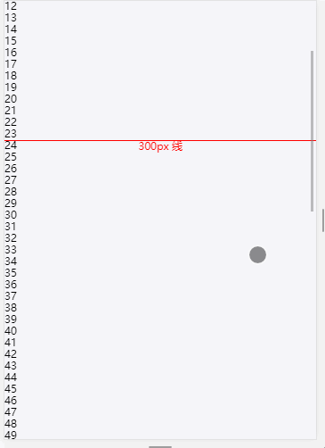

# tiny-scroll-listener

一个监听滚动的小工具

- - -



## 安装

```bash
npm install tiny-scroll-listener
```

## 使用方法

```javascript
import TinyScrollListener from 'tiny-scroll-listener'

const delay = time => new Promise(resolve => setTimeout(resolve, time))

const scrollListener = new TinyScrollListener({

  // 滚动容器，需设置 overflow: scroll/auto; 
  element: document.getElementId('scrollContainer'),

  // 触底函数相关
  distanceToReachEnd: 100, // 触底函数触发距离，默认为 100px
  async onEndReached(done) {
    console.log('到达了底部，锁定，两秒后释放')

    /**
     * 每次触发 onEndReached 函数后会自动阻止下一次触发，需要执行 done 函数来释放阻止
     * （例如滚动到底部后开始做网络请求时，再次滚动到底部不会触发二次请求）
     * 如果 isOver 为 true 则不会再触发后续的 onEndReached
     * （例如已经加载了全部页，不需要再监听触底事件）
     */
    await delay(2000)

    const isOver = false
    done(isOver)

    console.log('释放阻止')
  },

  /**
   * 任意滚动位置函数相关，常见场景为滚动到某距离时出现“回到顶部”按钮
   * onGoingIn、onGoingOut 只在值变迁瞬间执行一次，不会执行多次
   * 可设置多组监听
   */
  distanceEvents: [
    {
      distance: 300,
      onGoingIn() {
        console.log('滚动距离低于了 300px')
      },
      onGoingOut() {
        console.log('滚动距离高于了 300px')
      }
    }
  ]
})

// 手动解除监听
scrollListener.destroy()
